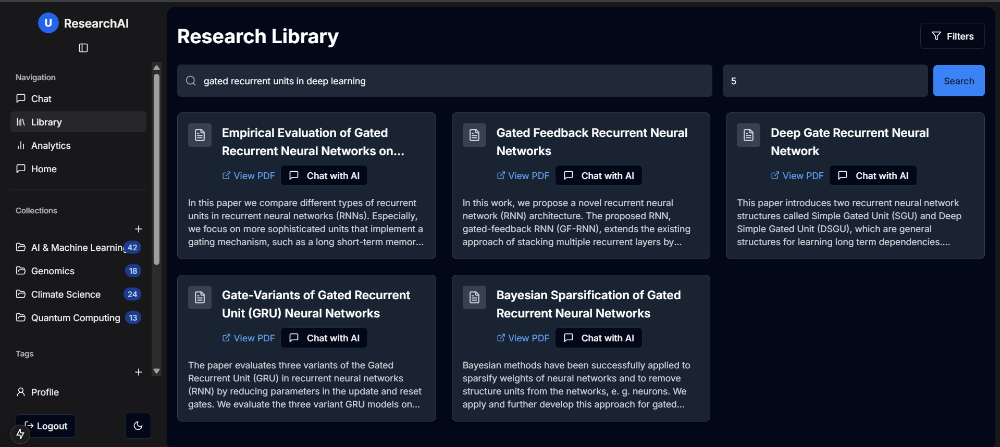
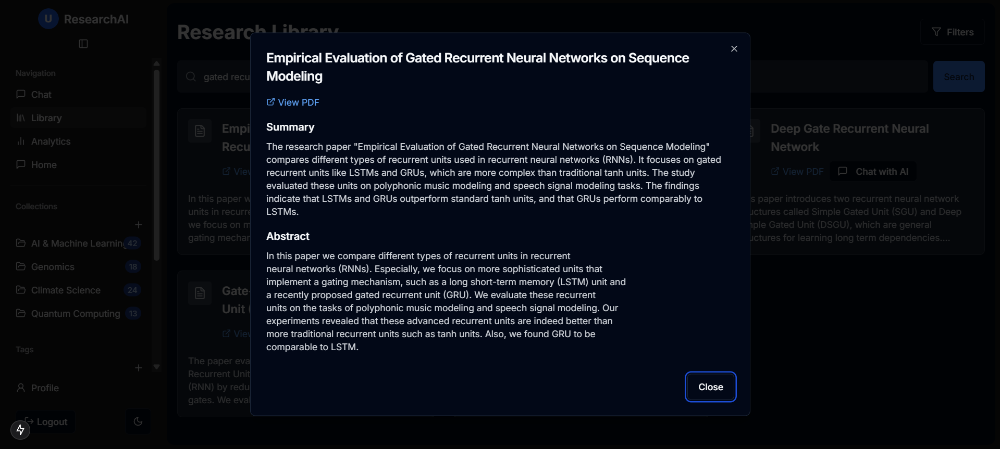
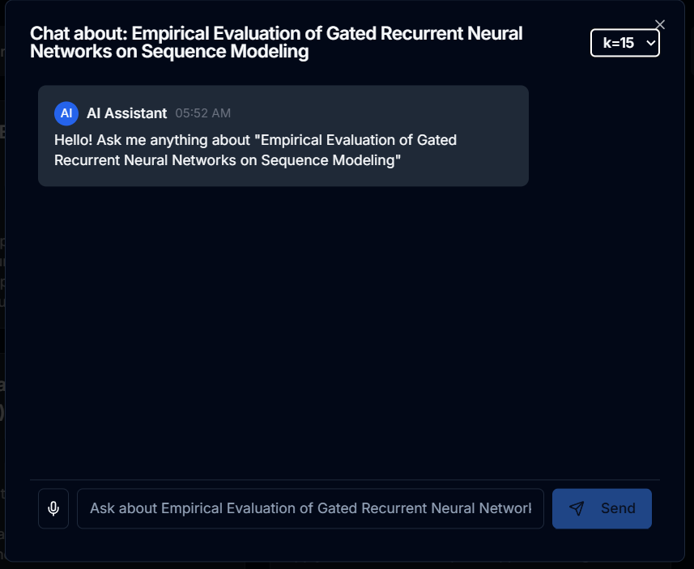
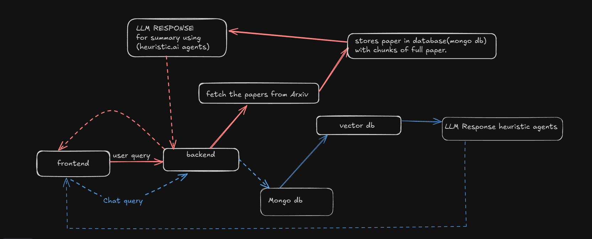
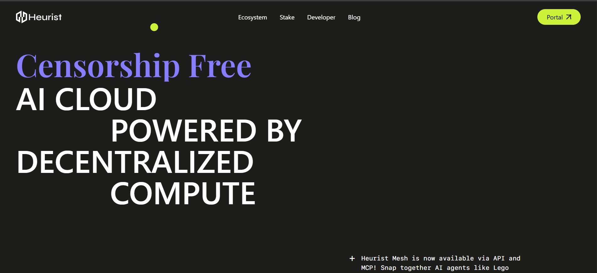
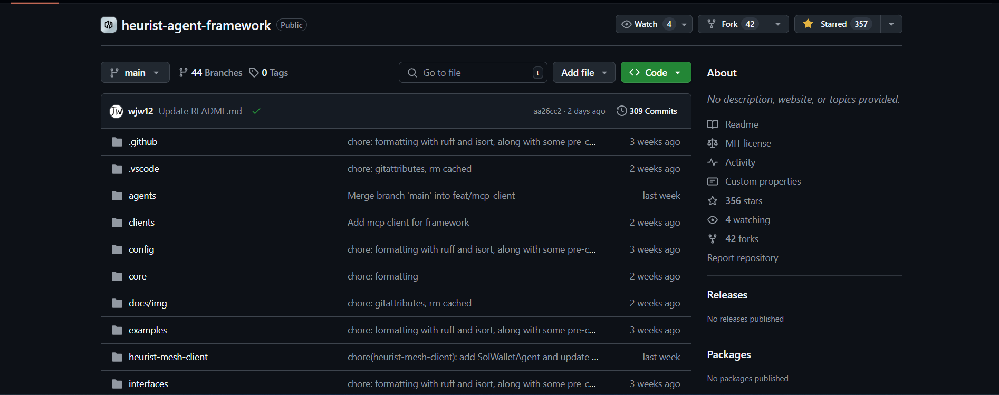

# ResearchAI: AI-Powered Research Paper Assistant

### ResearchAI Platform
  





### Heurist AI Website


[Walkthrough Their Repo](https://github.com/heurist-network)


## 📌 Overview

ResearchAI is an intelligent research assistant designed to help researchers save time when searching for and understanding academic papers. Instead of manually going through numerous papers, users can simply enter a query, and our heuristic AI agent will fetch and summarize the most relevant research papers.

## 🚀 How It Works

1. **User enters a query** → The system fetches around 30 relevant papers.
2. **AI selects the best papers** → Our heuristic AI agent filters and selects the top 5 papers using vector embeddings.
3. **Summarization & Explanation** → A summarizing heuristic AI agent generates concise summaries for each paper.
4. **Interactive Chat** → Users can engage in a chat-based environment to discuss the content of a selected paper.

## 🔥 Key Features

- **AI-Powered Search**: Finds and ranks the most relevant papers using heuristic AI techniques.
- **Summarization Agent**: Uses heuristic models to summarize papers efficiently.
- **Interactive Chat Environment**: Users can chat with an AI that understands the context of the selected research paper.
- **Vector Search with FAISS**: Papers are chunked and stored as vector embeddings for efficient retrieval.
- **Chat Memory with MongoDB**: Chat history is stored for context preservation.
- **Heuristic AI Agent Framework**: Provides multiple AI agents like Deep Research Agent, etc.

## 🛠️ Tech Stack

### Backend

- **Heuristic AI Agent Framework**: Provides multiple AI agents like Deep Research Agent, firecrawl, etc.
- **Flask**: Serves as the backend framework.
- **FAISS**: Stores and retrieves vector embeddings.
- **MongoDB**: Stores chat history and memory.
- **OAuth**: Enables secure authentication.
- **Node.js**
- **Express.js**

### Frontend

- **Next.js**: Used for server-side rendering and improved performance.
- **React.js**: Used for building an intuitive UI.
- **Redux**: Manages global state.
- **Tailwind CSS**: Styles the application.

## 📂 Project Setup

### 1. Install Dependencies

#### Backend

```bash
pip install -r requirements.txt
```

#### Frontend

```bash
pnpm install
```

### 2. Set Up Environment Variables

Rename `example.env` to `.env` and add necessary values (like GEMINI_API, MONGO_URL, PORT, etc.).

### 3. Run the Backend

For Flask:
```bash
python app.py
```

For Node.js/Express.js:
```bash
npm run dev
```
OR
```bash
node index.js
```

This starts the backend, which hosts the AI agents and APIs locally.

### 4. Run the Frontend

```bash
pnpm dev
```

This starts the frontend server, making the application accessible via the browser.

## 📺 Frontend Overview

- **Landing Page**: Entry point for users.
- **Home Page**: Displays recommended papers.
- **Chat Environment**: Allows users to interact with AI regarding specific papers.
- **Summary Page**: Displays AI-generated summaries.
- **Analytics Dashboard**: Provides insights and stats.

## 🎯 Challenges We Faced

- **Handling Large Data**: Processing large amounts of research data was challenging, so we split papers into chunks and stored them efficiently in a vector database (FAISS).
- **Maintaining Chat Memory**: To ensure the AI retains context, we stored chat histories in MongoDB.
- **Efficient Paper Ranking**: Developing a heuristic approach to rank the most relevant papers took effort.

## 🎥 Demo & Showcase
[Link To The Backend](https://github.com/anishk85/frostHcakBackend)
[Link Of Heurist Based Ai Agents](https://github.com/Davda-James/CryptoCoders)

[Watch the project walkthrough](https://youtu.be/XMh5Vm8Xtbc)

## 🙌 Acknowledgments

Big thanks to **Heuristic AI** for making this project possible!

